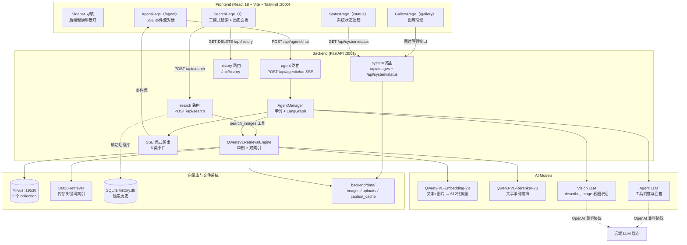
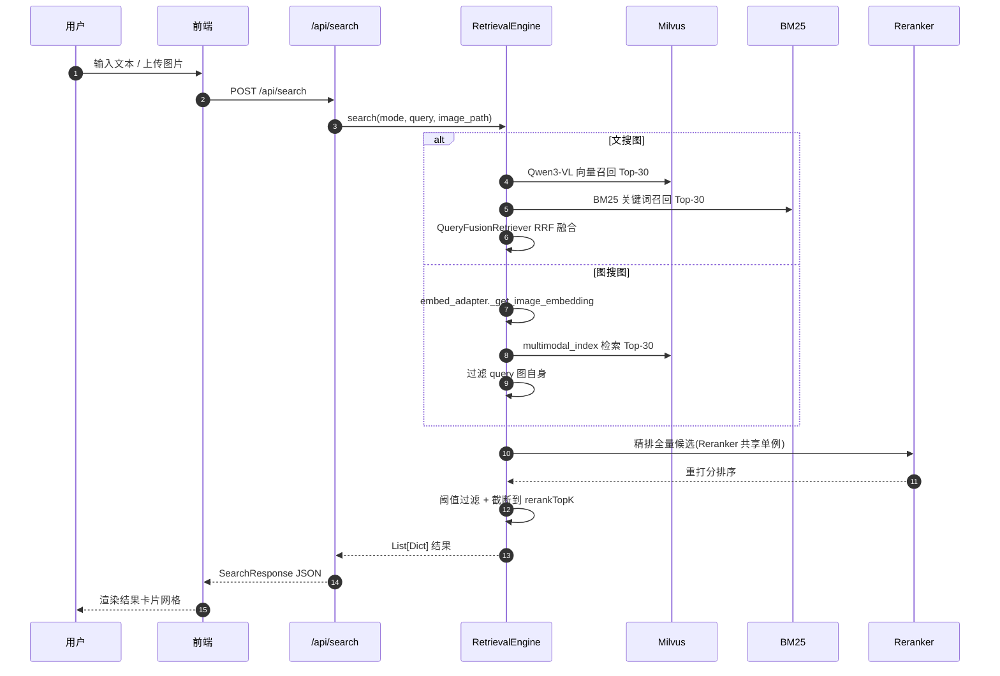

<div align="center">

# 🎨 GalleryMind

**多模态图像检索 + Agentic Chat 系统 —— 让 AI 看图找图、自然语言对话**

*Multimodal RAG with Qwen3-VL embedding, Milvus, BM25 fusion, and LangGraph Agent SSE streaming*

[](https://www.python.org/)
[](https://fastapi.tiangolo.com/)
[](https://react.dev/)
[](https://vitejs.dev/)
[](https://tailwindcss.com/)
[](https://milvus.io/)
[](https://langchain-ai.github.io/langgraph/)
[](https://modelscope.cn/models/qwen/Qwen3-VL-Embedding-2B)

[快速开始](#-快速开始) · [架构总览](#-架构总览) · [技术亮点](#-核心技术亮点) · [项目结构](#-项目结构) · [深度导读](./ZHIDAO.md)

</div>

---

## 📝 项目简介

GalleryMind 是一个把"Qwen3-VL 多模态嵌入 + Milvus 向量库 + BM25 关键词检索 + Qwen3-VL Reranker 精排 + LangGraph Agent + SSE 流式输出"串成一条完整链路的多模态 RAG 系统。

> 它不是"一个搜索引擎",而是**一个有眼睛会看图、有手会调工具的图像管理员**——你给它一句话或一张图,它先理解(embedding)、再翻箱倒柜(Milvus + BM25 召回)、再挑出最像的几张让评委打分(Qwen3-VL Reranker 精排),最后用大白话告诉你找到了啥(Agent 总结)。

前端为「侧栏导航 + 四页面」SPA,四条页面各管一件事:

| 页面 | 路由 | 后端接口 | 体验 |
|---|---|---|---|
| **检索页** | `/` | `POST /api/search` | 文搜图 / 图搜图 / 图文混合搜,参数滑块,历史面板一键重发 |
| **Agent 页** | `/agent` | `POST /api/agent/chat`(SSE) | 自然语言对话,LangGraph 自主调 search_images / describe_image 工具,思考链透明可见 |
| **图库页** | `/gallery` | `/api/images*` | 图片库管理:上传、删除、热重建索引,点图直接以图搜图 |
| **状态页** | `/status` | `GET /api/system/status` | Milvus 连通性 / 引擎初始化 / 模型配置 / 图库统计,只读巡检 |

💡 **推荐路径**:首次体验从 Mock 模式开始(`USE_MOCK_DATA=true`),5 分钟跑通前后端联调;再切真实模式,加载 Qwen3-VL 模型体验完整能力。

---

## ✨ 核心技术亮点

- 🔍 **双索引系统**(`backend/core/retrieval.py`)——图搜图与文搜图分离:Milvus `qwen3_vl_image_only` 集合(仅图片向量)专给图搜图,`qwen3_vl_hybrid_agent` 集合 + BM25 给文搜图,避免一种索引兼顾两种检索模式互相干扰。

- 🧠 **三路召回 + RRF 融合**(`Qwen3VLRetrievalEngine.text_to_image_search`)——Qwen3-VL 跨模态向量 + BM25 关键词字面匹配 + (可选 caption 向量),通过 `QueryFusionRetriever(mode="reciprocal_rerank")` 融合,语义与字面互补提升召回率。

- ⚡ **共享 Reranker 模型单例**(`Qwen3VLRetrievalEngine.initialize`)——Qwen3-VL-Reranker-2B 是 2B 大模型,每次检索重新加载会拖慢响应。启动时通过临时 postprocessor 加载一次,后续每次检索创建轻量包装器复用同一模型实例。

- 📐 **L2 归一化 + 512 维截断**(`Qwen3VLEmbedding._get_embedding_from_model`)——嵌入向量除以模长转为单位向量,再截断到 512 维适配 Milvus 集合维度,配合 `similarity_metric="IP"` 实现余弦相似度。

- 🛡️ **LlamaIndex 全局 embed_model 覆盖**(`Qwen3VLRetrievalEngine.initialize`)——`Settings.embed_model = self.embed_adapter` 防止 LlamaIndex 在某些路径(如 `RetrieverQueryEngine.query`)fallback 到默认 OpenAI embedding,避免消耗 API 额度且维度不匹配。

- 🤖 **LangGraph Agent + SSE 6 类事件流**(`backend/core/agent.py`)——`create_agent` + `InMemorySaver` checkpointer,Agent 推理过程拆解为 `thinking → tool_call → process → results → summary → complete` 六类事件实时推送,让用户看见"AI 在思考、在调工具、在出结果"。

- 🚫 **图搜图自身过滤**(`image_to_image_search`)——检索结果中排除 query 图自身,防止返回"最像的就是你自己"。

- 🧪 **Mock 模式开关**(`routers/search.py`)——`USE_MOCK_DATA=true` 不加载任何模型即可跑通前后端联调,适合纯前端开发与 CI 测试。

<!-- CC: 新增(以下 4 条) -->

- 🗂️ **图库管理 + 热重建索引**(`backend/routers/system.py`)——上传 / 删除图片无需重启服务,`POST /api/images/reindex` 在线重建向量索引;文件名白名单正则校验 + 并发锁,杜绝路径穿越与重复重建。

- 🕘 **SQLite 检索历史**(`backend/routers/history.py`)——每次检索成功后自动落库(查询词 / 模式 / 结果数 / 耗时 / Mock 标记),WAL 日志模式降低读写互锁;历史记录失败绝不拖垮检索主流程,前端历史面板一键重发。

- 🩺 **只读系统巡检**(`backend/routers/system.py`)——`GET /api/system/status` 汇总 Milvus 连通性 / 引擎初始化状态 / 四组模型配置 / 图库统计,全部只读探测,状态页绝不顺带触发模型加载。

- 🎭 **Agent / Vision 双模型独立配置**(`backend/config.py`)——Agent 推理(工具调度)与看图说话(`describe_image`)可分别指定模型 / Key / 端点,未设置时自动回退 `OPENAI_API_KEY` 旧配置,兼容存量 `.env`。

---

## 🖥️ 前端功能全景

<!-- CC: 新增(本节) -->

前端整体重写:React Router 多页路由 + Tailwind CSS 4 原子化样式 + Phosphor 图标,亮色极简单主题,`<768px` 侧栏自动退化为顶部导航条,侧栏常驻后端健康呼吸灯(轮询 `/api/ping`)。

- 🔍 **检索页(`/`,SearchPage)**——三检索模式切换;召回 / 精排 / 阈值滑块;骨架屏加载态;结果网格 + Lightbox 大图(可对结果再发起以图搜图);历史面板展示最近检索,条目一键重发、一键清空。

- 💬 **Agent 页(`/agent`,AgentPage)**——SSE 流式消费 6 类事件,实时渲染思考链(ThinkingLine)、工具调用(ToolLine)、检索结果卡片与最终总结;支持上传图片提问与会话重置。

- 🖼️ **图库页(`/gallery`,GalleryPage)**——图片库网格浏览(文件名 / 大小 / 时间 / caption);上传入库、删除、热重建索引;点击任意图片"以此图检索"直达检索页。

- 🩺 **状态页(`/status`,StatusPage)**——后端版本、Milvus 连通性、引擎初始化、Embedding / Reranker / Agent / Vision 四组模型配置、图片与 caption 数量,红绿灯一目了然。

---

## 🏗️ 架构总览



<details><summary><b>📊 核心检索链路时序图</b>(点击展开)</summary>



</details>

---

## 🛠️ 技术栈

| 层级 | 技术 | 版本 | 用途 |
|---|---|---|---|
| **后端框架** | FastAPI + Uvicorn | 0.120 / 0.38 | 异步 Web 框架 + ASGI 服务器 |
| **RAG 框架** | LlamaIndex Core | 0.14.12 | VectorStoreIndex / QueryFusionRetriever / Reranker 适配 |
| **向量库** | Milvus + pymilvus | 2.3.21 / 2.6.3 | 向量存储与相似度检索 |
| **关键词检索** | llama-index-retrievers-bm25 | 0.6.5 | BM25 文本检索 |
| **Agent 框架** | LangChain + LangGraph | 1.2.1 / 1.0.5 | `create_agent` + `InMemorySaver` checkpointer |
| **嵌入/精排模型** | Qwen3-VL-Embedding-2B / Qwen3-VL-Reranker-2B | via ModelScope | 多模态嵌入(512维)+ 精排 |
| **LLM 调用** | langchain-openai | 1.1.6 | Agent 推理 + describe_image 看图说话(Agent / Vision 可独立配置) |
| **深度学习** | PyTorch + Transformers + qwen-vl-utils | 2.9 / 4.57 / 0.0.14 | 模型加载与前向推理 |
| **历史存储** | SQLite(标准库) | — | 检索历史持久化(WAL 模式) |
| **前端框架** | React + TypeScript | 18.3 / 5.6 | 组件化 UI |
| **前端路由** | react-router-dom | 6.30 | 四页面 SPA(检索 / Agent / 图库 / 状态) |
| **样式方案** | Tailwind CSS | 4.1 | 原子化 CSS + `@theme` 主题令牌(亮色极简) |
| **图标** | @phosphor-icons/react | 2.1 | 图标库 |
| **构建工具** | Vite + @vitejs/plugin-react | 6.x / 4.3 | 极速 HMR 构建 |
| **容器化** | Docker Compose | — | Milvus 三件套(etcd + minio + milvus) |

<details><summary><b>📦 后端 Python 依赖全表</b>(点击展开)</summary>

```text
# Web 框架
fastapi==0.120.0
uvicorn[standard]==0.38.0
python-dotenv==1.1.1
pydantic==2.11.10

# LlamaIndex
llama-index-core==0.14.12
llama-index-llms-openai==0.6.13
llama-index-vector-stores-milvus==0.9.5
llama-index-retrievers-bm25==0.6.5

# LangChain & LangGraph
langchain==1.2.1
langchain-openai==1.1.6
langgraph==1.0.5

# AI/ML 模型
transformers==4.57.1
torch==2.9.0
torchvision==0.24.0
qwen-vl-utils==0.0.14
pillow==11.3.0
numpy==2.2.6
scipy==1.16.2

# 模型下载
modelscope==1.31.0

# 向量数据库
pymilvus==2.6.3

# 工具库
requests==2.32.5
```

</details>

---

## 📁 项目结构

```
GalleryMind/
├── backend/                          ⭐ 后端:FastAPI + 多模态 RAG 引擎
│   ├── main.py                       📋 FastAPI 入口,lifespan 预热引擎+Agent,挂载 /static
│   ├── config.py                     🔧 配置中枢(.env + 路径 + 模型ID + 端口)
│   ├── .env.example                  🧪 环境变量模板(含 Agent/Vision 独立配置示例)
│   ├── schemas.py                    📋 Pydantic 请求/响应模型(前后端契约)
│   ├── core/                         ⭐ 核心业务逻辑
│   │   ├── retrieval.py              🔐 检索引擎(800 行,项目核心)
│   │   ├── agent.py                  🔐 Agent 管理(LangGraph + SSE 流式)
│   │   └── utils.py                  🔧 base64 图片落地 + URL 转换
│   ├── routers/                      📋 FastAPI 路由层(5 个模块)
│   │   ├── search.py                 🔐 POST /api/search 同步检索
│   │   ├── agent.py                  🔐 /api/agent/* SSE 流式 + 会话重置
│   │   ├── system.py                 🆕 图库管理 + /api/system/status 状态巡检
│   │   ├── history.py                🆕 /api/history 检索历史(SQLite)
│   │   └── health.py                 🧪 /api/health + /api/ping 健康检查
│   └── data/                         📂 运行时数据(自动创建)
│       ├── images/                   📂 图片库(被检索对象)
│       ├── uploads/                  📂 用户上传的临时图片
│       ├── models/                   📂 ModelScope 模型缓存
│       ├── caption_cache/            📂 图片文本描述缓存(.txt)
│       └── history.db                🆕 检索历史数据库(SQLite,自动创建)
│
├── frontend/                         ⭐ 前端:React 18 + Vite + TS + Tailwind CSS 4(全新重写)
│   ├── package.json                  📋 依赖清单(react-router-dom / tailwindcss / phosphor-icons)
│   ├── vite.config.ts                🔧 Vite 配置(:3000,/api 与 /static 代理到 3001)
│   └── src/
│       ├── App.tsx                   🔐 应用骨架(侧栏布局 + 4 条路由)
│       ├── api.ts                    🔐 后端 API 客户端(全部接口封装 + SSE 解析)
│       ├── types.ts                  📋 TypeScript 类型定义(与 schemas.py 对齐)
│       ├── index.css                 🎨 Tailwind 主题令牌(亮色极简单主题)
│       ├── components/               ⭐ 通用组件
│       │   ├── Sidebar.tsx           🔐 侧栏导航 + 后端健康呼吸灯
│       │   ├── ImageUploader.tsx     🔐 图片上传(预览 / 移除 / 紧凑模式)
│       │   └── Lightbox.tsx          🔐 大图查看(以图搜图 / 删除 / 元信息)
│       └── pages/                    ⭐ 四大页面
│           ├── SearchPage.tsx        🔐 检索页(三模式 + 参数滑块 + 历史面板)
│           ├── AgentPage.tsx         🔐 Agent 对话页(思考链 / 工具调用 / 结果渲染)
│           ├── GalleryPage.tsx       🔐 图库页(上传 / 删除 / 热重建索引)
│           └── StatusPage.tsx        🔐 状态页(Milvus / 引擎 / 模型 / 图库巡检)
│
├── volumes/                          📂 Milvus Docker 数据卷(自动生成)
├── docker-compose.yml                🔧 Milvus 三件套
├── ZHIDAO.md                         📖 项目导读地图(10 章黄金模板)
├── README.md                         📖 本文件
└── Description.md                    📖 项目名片(中英双版)
```

> 📖 **逐文件深度导读见 [ZHIDAO.md](./ZHIDAO.md)**——含运行流程全景图、逐文件代码导读、关键设计模式解析、配置系统详解、复刻路线与常见问题。

---

## 🚀 快速开始

### 0️⃣ 环境要求

| 组件 | 版本 | 默认端口 | 说明 |
|---|---|---|---|
| Python | 3.10+ | — | 见 `requirements.txt` |
| Node.js | 18+ | — | 见 `frontend/package.json` |
| Docker | 20+ | — | 用于跑 Milvus |
| Milvus | v2.3.21 | 19530 | 向量数据库(Docker 启动) |
| GPU(可选)| CUDA 11.8+ | — | 无 GPU 则 CPU 推理(慢 10-50 倍) |

### 1️⃣ 启动 Milvus 向量数据库

```bash
cd D:/1/GalleryMind
docker-compose up -d

# 验证三个容器启动
docker ps
# 应看到:milvus-standalone / milvus-etcd / milvus-minio
```

### 2️⃣ 准备图片库

```bash
mkdir -p backend/data/images
# 把你的图片(.png / .jpg / .jpeg / .gif)放到 backend/data/images/
# 也可以启动后在网页「图库页」直接上传
```

### 3️⃣ 配置后端环境变量

```bash
cd backend
cp .env.example .env    # Windows CMD 用:copy .env.example .env
```

编辑 `.env`,至少配置一个可用 Key:

- **简单模式**:只填 `OPENAI_API_KEY`(Agent 与 Vision 共用)
- **进阶模式**:`AGENT_LLM_*` 与 `VISION_LLM_*` 分别指定模型(需支持 function calling / 图片输入),未填的项自动回退 `OPENAI_*`

### 4️⃣ 安装后端依赖

```bash
# 在项目根目录执行
# 1. 创建虚拟环境（在项目根目录生成 .venv）
uv venv .venv

# 2. 激活
source .venv/Scripts/activate   # Git Bash
# .venv\Scripts\activate        # CMD / PowerShell

# 3. 按 requirements.txt 装依赖
uv pip install -r requirements.txt
```

### 5️⃣ 启动后端

```bash
python -m backend.main
# 或:cd backend && python main.py
```

> ⚠️ **首次启动**会从 ModelScope 下载 `Qwen3-VL-Embedding-2B`(约 4GB)和 `Qwen3-VL-Reranker-2B`(约 4GB)到 `backend/data/models/`,需 10-30 分钟(取决于网络)。后续启动从本地缓存加载约 30-60 秒。
>
> 看到以下日志说明就绪:
> ```
> 🚀 Server starting on 0.0.0.0:3001
> ✅ 检索引擎和Agent就绪
> ```

<details><summary><b>🧪 Mock 模式</b>:不加载模型快速跑通前后端(点击展开)</summary>

```bash
# 设置环境变量启动 Mock 模式
USE_MOCK_DATA=true python -m backend.main
# 不下载模型、不连 Milvus,直接返回预设假数据,适合纯前端开发与联调
```

</details>

### 6️⃣ 启动前端

```bash
# 另开终端
cd frontend
npm install
npm run dev
# 浏览器打开 http://localhost:3000
```

### 7️⃣ 体验核心链路

**检索页(`/`)**:
- 输入文本(如"红色跑车")或上传图片,或两者都有(混合搜)
- 调节召回 Top-K / 精排 Top-K / 阈值滑块,点"开始检索"
- 点结果图可在 Lightbox 中"以此图再搜";左侧历史面板一键重发历史查询

**Agent 页(`/agent`)**:
- 自然语言对话:"帮我找一张红色跑车的图片,并描述它的内容"
- 实时观察思考链 → 工具调用 → 检索结果 → 总结

**图库页(`/gallery`)**:
- 上传新图片入库、删除不需要的图片,然后点"重建索引"(热更新,无需重启后端)
- 点任意图片"以此图检索"直达检索页

**状态页(`/status`)**:
- 查看后端版本、Milvus 连通性、引擎初始化、四组模型配置是否正常

**直接调 API 测试**:

```bash
# 同步检索
curl -X POST http://localhost:3001/api/search \
  -H "Content-Type: application/json" \
  -d '{"searchMode":"文搜图","textQuery":"测试","recallTopK":20,"rerankTopK":5,"threshold":0.0}'

# Agent SSE 流式
curl -N -X POST http://localhost:3001/api/agent/chat \
  -H "Content-Type: application/json" \
  -d '{"message":"帮我找一张红色跑车的图片"}'

# 检索历史
curl http://localhost:3001/api/history?limit=5
```

<details><summary><b>🔌 API 一览</b>(点击展开)</summary>

| 方法 | 路径 | 说明 |
|---|---|---|
| GET | `/api/health` · `/api/ping` | 健康检查 / 轻量探活(前端呼吸灯轮询) |
| POST | `/api/search` | 同步多模态检索:文搜图 / 图搜图 / 混合搜 |
| POST | `/api/agent/chat` | Agent 对话,SSE 流式返回 6 类事件 |
| POST | `/api/agent/session/reset` | 重置指定会话的 Agent 记忆 |
| GET | `/api/images` | 图片库列表(文件名 / URL / 大小 / 时间 / caption) |
| POST | `/api/images/upload` | 上传图片入库 |
| DELETE | `/api/images/{filename}` | 删除图片 |
| POST | `/api/images/reindex` | 热重建向量索引(无需重启) |
| GET | `/api/system/status` | 系统状态巡检(只读,不触发模型加载) |
| GET | `/api/history?limit=20` | 检索历史(SQLite 持久化) |
| DELETE | `/api/history` | 清空检索历史 |

交互式文档:后端启动后访问 `http://localhost:3001/docs`(Swagger UI)。

</details>

---

## ⚙️ 配置说明

| 变量 | 必填 | 默认值 | 说明 |
|---|---|---|---|
| `OPENAI_API_KEY` / `OPENAI_BASE_URL` | ⬜ | — / `https://api.openai.com/v1` | 旧版兼容配置,Agent / Vision 未单独设置时回退使用 |
| `AGENT_LLM_MODEL` | ⬜ | `gpt-4o` | Agent 推理模型(需支持 function calling) |
| `AGENT_LLM_API_KEY` / `AGENT_LLM_BASE_URL` | ⬜ | 回退 `OPENAI_*` | Agent 模型凭证与端点 |
| `VISION_LLM_MODEL` | ⬜ | `gpt-4o` | Vision 视觉模型(describe_image 用,需支持图片输入) |
| `VISION_LLM_API_KEY` / `VISION_LLM_BASE_URL` | ⬜ | 回退 `OPENAI_*` | Vision 模型凭证与端点 |
| `MILVUS_URI` | ⬜ | `http://localhost:19530` | Milvus 连接串 |
| `IMAGE_DIR` | ⬜ | `backend/data/images` | 被检索的图片库路径 |
| `MODELSCOPE_CACHE` | ⬜ | `backend/data/models` | ModelScope 模型缓存目录 |
| `USE_MOCK_DATA` | ⬜ | `false` | Mock 模式开关(跳过模型加载) |

> `HOST` / `PORT`(默认 `0.0.0.0:3001`)、`ALLOWED_ORIGINS`、`EMBEDDING_DIM` 为代码内常量,见 `backend/config.py`。

💡 **最低可用配置**:仅需在 `backend/.env` 设置 `OPENAI_API_KEY=sk-xxx`(或 Agent / Vision 各自的 Key);若用 Mock 模式连 Key 都不需要。完整模板与多厂商示例(DeepSeek / 通义 / GLM / Ollama)见 `backend/.env.example`。

---

## 🧭 Roadmap

- [x] 双索引系统(图搜图 + 文搜图分离)
- [x] 三路召回 + RRF 融合(Qwen3-VL 向量 + BM25)
- [x] Qwen3-VL Reranker 精排(共享单例)
- [x] LangGraph Agent + SSE 6 类事件流
- [x] Mock 模式快速联调
- [x] 前端重写:React Router 四页面 + Tailwind 4 亮色极简主题
- [x] 图库管理(上传 / 删除 / 热重建索引)
- [x] SQLite 检索历史(一键重发 / 清空)
- [x] 系统状态页(只读巡检)
- [x] Agent / Vision 模型独立配置
- [ ] Caption 索引重启用(性能优化)
- [ ] Agent 多用户会话隔离(替换 `thread_id="session_default"`)
- [ ] 检索过程真实进度上报
- [ ] 持久化 Checkpointer(PostgresSaver / RedisSaver)

---

<div align="center">

**🤝 参与贡献**

Fork → 创建分支 → 提交 PR

如果这个项目对你有帮助,欢迎 ⭐ Star 支持!

**📖 完整项目导读** · [ZHIDAO.md](./ZHIDAO.md) · **📋 项目名片** · [Description.md](./Description.md)

</div>
